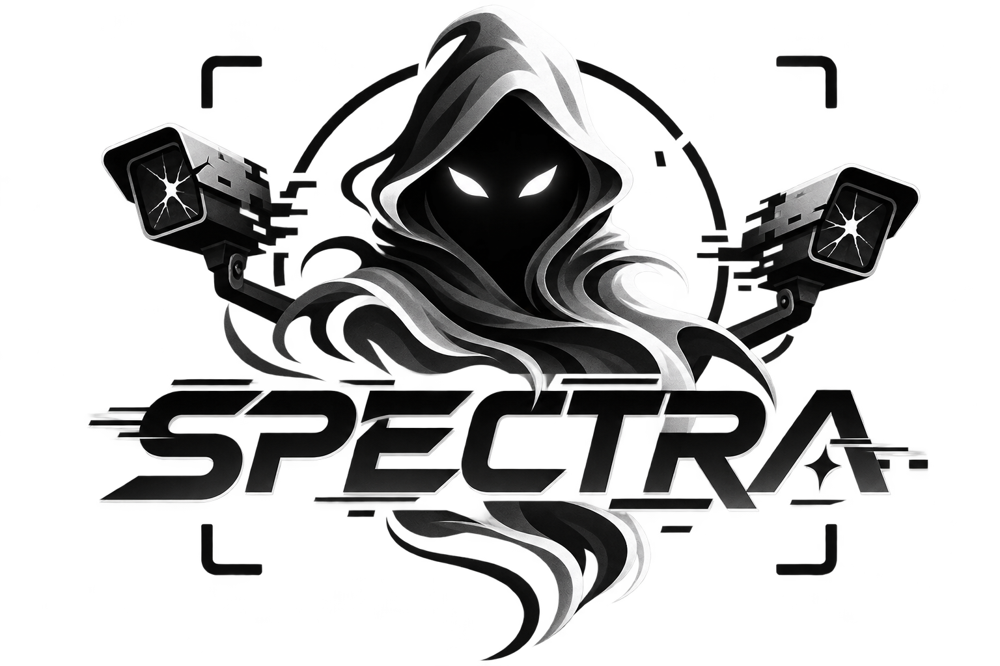
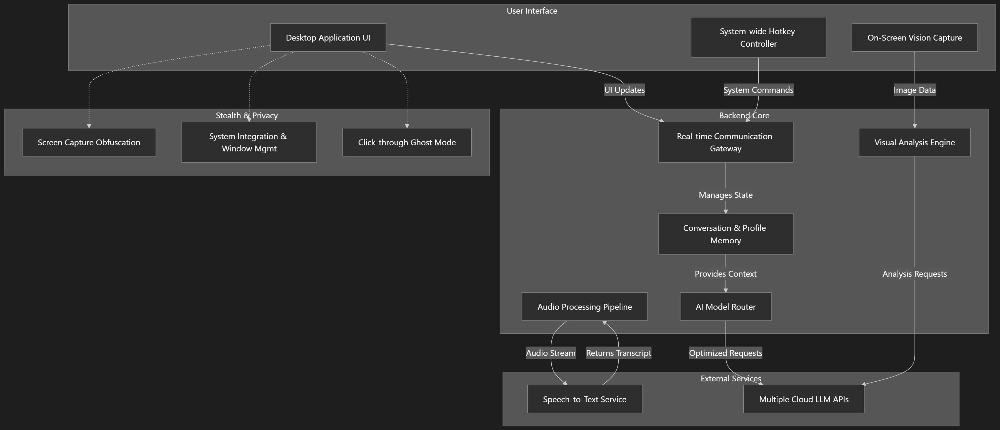

# 👻 Spectra — The AI They Can't See, Can't Detect, Can't Stop

<div align="center">
  
</div>

<div align="center">

[](https://github.com/arthurhenriquelopes/Spectra/actions/workflows/tests.yml)
[](https://github.com/arthurhenriquelopes/Spectra/actions/workflows/lint.yml)
[](https://github.com/arthurhenriquelopes/Spectra/releases)
[](https://github.com/arthurhenriquelopes/Spectra/releases)
[](https://github.com/arthurhenriquelopes/Spectra/blob/main/LICENSE)
[](https://github.com/arthurhenriquelopes/Spectra/stargazers)

</div>

**An invisible AI overlay that lives on your screen — answers questions, solves problems, analyzes screenshots, and feeds you real-time intelligence. Works during interviews, exams, meetings, or anything on your screen. Invisible to screen recordings and proctoring software.**

---

## ✨ Features

- 👻 **Ultimate Stealth** — Utilizes Windows low-level `WDA_EXCLUDEFROMCAPTURE` API to remain completely invisible to screen recording, screen sharing, and proctoring tools.
- 🎤 **Real-Time Voice AI** — Powered by Deepgram STT. Listens to the conversation and provides real-time coaching customized to your resume and the job description.
- 👁️ **Vision AI** — Silent screenshot capture and multi-modal analysis (Code, System Design, Math, DB Schemas) using Gemini and Groq.
- ⚡ **Multi-Provider Engines** — Supports Cerebras (fastest text inference on Earth), Groq, Gemini, and OpenRouter with automatic failover and API key rotation.
- ⌨️ **Focus-Free Control** — Fully controllable via global hotkeys. You never need to click the app or switch focus from your main screen.

---

## 🆚 Comparison

| **Feature** | **Spectra** | **Interview Coder** | **Parakeet AI** | **LockedIn AI** |
|---|---|---|---|---|
| **Cost** | 🆓 Bring your own keys | 💸 $25/month | 💸 Credits | 💸 Subscription |
| **Vision AI** | ✅ Screenshots + Diagrams + Code | ❌ No | ❌ No | ❌ No |
| **Stealth** | ✅ **Undetectable** (Screen Capture Proof, Ghost Mode) | ✅ Partial | ✅ Partial | ❌ Detectable |
| **Speed** | ⚡ **Fastest** (Cerebras + Groq = sub-second) | ❌ Slow | ❌ Sluggish | ❌ Laggy |

---

## 🏗️ Architecture & Tech Stack

<div align="center">
  
</div>

- **Backend:** Python 3.8+, FastAPI, Uvicorn, Asyncio
- **Frontend/Desktop Shell:** PyWebView (WinForms Edge Chromium backend)
- **Stealth & System:** `ctypes` (Win32 APIs), `pynput` (Global Hotkeys)
- **AI Integrations:** Deepgram SDK (STT), OpenAI-compatible LLM clients

---

## 🚀 Getting Started

### System Requirements
- **OS:** Windows 10/11 or Linux.
- **Python:** 3.8+ (Ensure Python is added to your PATH).
- **Microphone:** Required for real-time transcription.

### Installation

```bash
git clone https://github.com/arthurhenriquelopes/Spectra.git
cd Spectra
```

**Launch using the Native Auto-Updater Executable:**
Just double-click `Spectra.exe`. It will automatically check for updates, create the virtual environment, install PIP dependencies, and launch the application completely silently while masquerading as `NetworkAdapter.exe` to evade process scanning.

**Or manually via terminal (Windows):**
```bash
python -m venv venv
venv\Scripts\activate
pip install -r requirements.txt
python main.py
```

**Linux (Terminal):**
```bash
python3 -m venv venv
source venv/bin/activate
pip install -r requirements.txt
python main.py
```

---

## 🔑 API Keys

Spectra is 100% free, but requires your own API keys. Generous free tiers are available for all providers:

1. **Deepgram (Required):** For real-time speech-to-text. [Get Free Key](https://console.deepgram.com/)
2. **Cerebras (Recommended):** Blazing fast text inference. [Get Free Key](https://cloud.cerebras.ai/)
3. **Groq (Recommended):** Fast text and vision models. [Get Free Key](https://console.groq.com/)
4. **Gemini (Recommended):** Highly accurate vision models. [Get Free Key](https://aistudio.google.com/)

*Enter your keys directly in the UI onboarding screen or in `ai_providers.json`.*

---

## ⌨️ Global Hotkeys Reference

| Category | Hotkey | Action |
|:---|:---|:---|
| **Stealth** | `Alt + Shift + S` | **Activate Proctoring Stealth Mode** |
| | `Alt + Z` | Toggle window visibility |
| | `Alt + X` | Toggle Ghost Mode (click-through interactions) |
| | `Alt + 1 / 2 / 3` | Set transparency (40% / 70% / 100%) |
| **Vision AI** | `Alt + V` | Toggle Vision Mode |
| | `Alt + S` | Capture silent screenshot (queue up to 4) |
| | `Alt + P` | Process screenshot queue |
| | `Alt + R` | Reset screenshot queue |
| | `Alt + T` | Cycle vision provider (Gemini / Groq) |
| **Scroll / UI** | `Alt + ↑` / `↓` | Scroll AI suggestions (hold for continuous) |
| | `Home` / `End` | Jump to top / bottom |
| | `Alt + Left / Right` | Move overlay window horizontally |
| | `Alt + I` / `J` | Move overlay window up / down |
| **AI / Audio** | `Alt + Q` / `W` | Switch to primary / secondary LLM |
| | `Alt + E` | Auto-select fastest available LLM |
| | `Alt + M` | Toggle microphone mute |
| | `Alt + U` | Toggle universal mute (pause all) |
| | `Alt + O` | Reset interview session |

---

## 🔧 Configuration

All settings are stored in `.env`. The app creates this automatically on first launch.

```env
# ─── API Keys ───
DEEPGRAM_API_KEY="your_key"

# ─── AI Behaviour ───
TRACK_CANDIDATE_RESPONSES=true
INCLUDE_CONVERSATION_HISTORY=true
GENERATE_FULL_ANSWERS=true
PERSONALIZE_ANSWERS=true

# ─── Scroll Speed ───
SCROLL_SPEED_PX=200
SCROLL_INTERVAL_MS=50
```

---

## 🤝 Contributing

Pull requests are welcome! 
1. Fork the repository
2. Create your feature branch (`git checkout -b feature/AmazingFeature`)
3. Commit your changes (`git commit -m 'Add some AmazingFeature'`)
4. Push to the branch (`git push origin feature/AmazingFeature`)
5. Open a Pull Request.

---

## ⚠️ Disclaimer

**This tool is provided for educational and research purposes only.** Users are solely responsible for complying with the policies, terms of service, and regulations of any institution, exam provider, or employer. The developers of Spectra assume no liability for misuse, disqualification, or policy violations.

---

<div align="center">
  <b>Spectra is released under the MIT License.</b>
</div>
